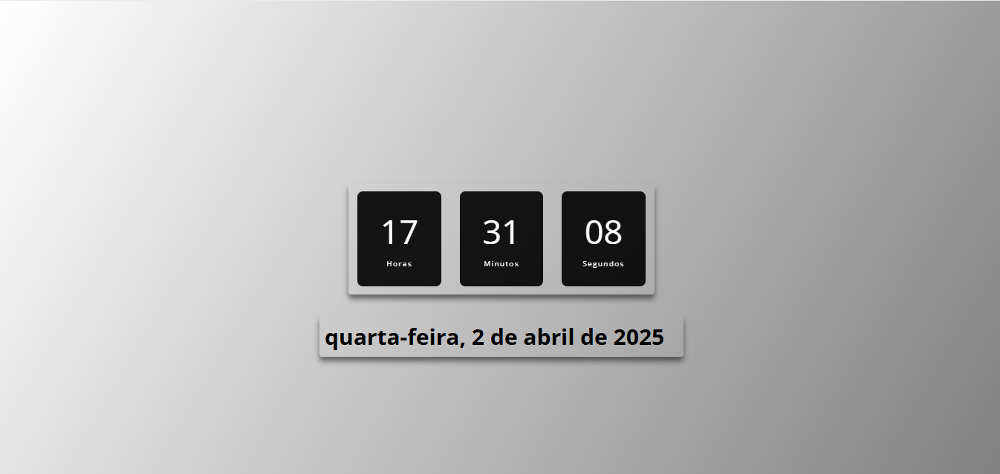

<h2>Relógio Digital</h2>
 
 
<h4>Projeto funcional onde mostra data e o hora e dia da semana atual, optei por usar um background gradient para dar um contraste de cores e dar mais um charme ao projeto.As tecnologias utilizadas foram:</h3>
 
 
<h3>• Html</h3>
<h3>• CSS</h3>
<h3>• JAVA SCRIPT</h3>
 

 
<h4>Link do Projeto <a href="https://micaelmarcos13.github.io/Relogio-digital">Relógio Digital</a></h4>
